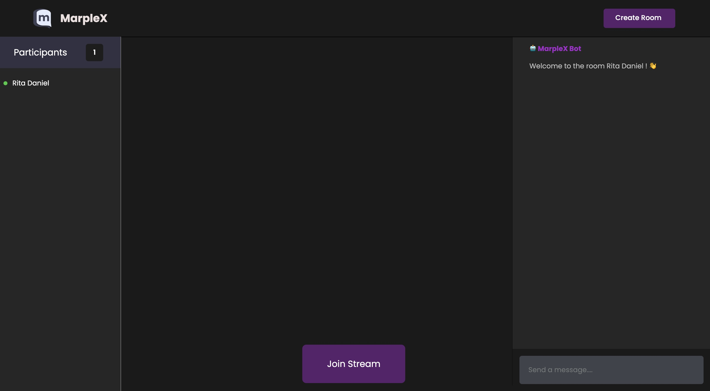

<a name="readme-top"></a>

<div align="center">

  
  <br/>

  <h3><b>Welcome to my README</b></h3>

</div>

# 📗 Table of Contents

- [📖 About the Project](#about-project)
  - [🛠 Built With](#built-with)
    - [Tech Stack](#tech-stack)
    - [Key Features](#key-features)
  - [🚀 Live Demo](#live-demo)
- [💻 Getting Started](#getting-started)
  - [Setup](#setup)
  - [Prerequisites](#prerequisites)
  - [Install](#install)
  - [Usage](#usage)
  - [Run tests](#run-tests)
  - [Deployment](#triangular_flag_on_post-deployment)
- [👥 Authors](#authors)
- [🔭 Future Features](#future-features)
- [🤝 Contributing](#contributing)
- [⭐️ Show your support](#support)
- [🙏 Acknowledgements](#acknowledgements)
- [❓ FAQ](#faq)
- [📝 License](#license)

# 📖 [MarpleX] <a name="about-project"></a>

> A real time messaging & video calling web app.

**[MarpleX]** is a real time messaging & video calling web app.

## 🛠 Built With <a name="built-with"></a>

- HTML
- CSS
- Javascript

### Tech Stack <a name="tech-stack"></a>

<details>
  <summary>Client</summary>
  <ul>
    
    <li>
    <a href="#">Index.html</a>
    </li>

    <li>
    <a href="#">main.js</a>
    </li>

    <li>
    <a href="#">Style.css</a>
    </li>
  
  </ul>
</details>

### Key Features <a name="key-features"></a>

- **[Allow users to make video and audio calls with other users in real-time.]**
  
- **[Users are able to chat with each other during video calls ]**
  
- **[The web app has a user-friendly interface, with easy-to-use controls and intuitive navigation, to ensure a smooth and enjoyable user experience.]**

<p align="right">(<a href="#readme-top">back to top</a>)</p>

## 🚀 Live Demo <a name="live-demo"></a>


- [Live Demo Link](https://marplexr.netlify.app/)

<p align="right">(<a href="#readme-top">back to top</a>)</p>

## 🎥 WALKTHROUGH <a name="walkthrough"></a>

<a name="loom link">[Loom Recording](https://www.loom.com/share/d732a05d74ad4217912e72631a4ecf63)</a>

<p align="right">(<a href="#readme-top">back to top</a>)</p>

## Project Screenshots



<p align="right">(<a href="#readme-top">back to top</a>)</p>

## 💻 Getting Started <a name="getting-started"></a>

To get a local copy up and running, follow these steps.

### Prerequisites

- In order to run this project you need:

- [git](https://git-scm.com/downloads): A tool for managing source code
- [Visual Studio Code](https://code.visualstudio.com/): A source code editor
- [Live Server](https://marketplace.visualstudio.com/items?itemName=ritwickdey.LiveServer): A simple web server utility for Visual Studio Code
### Setup

Clone this repository to your desired folder:

- Copy [this link](https://github.com/RitaDee/marplex-video-rtm.git)
- get to the directory that you want to clone the repository.
- open the command prompt in this directory.https://github.com/RitaDee/marplex-video-rtm.git`
- go to the repository folder in your command prompt cd project file
- write `code .` to open the project in visual studio code.
- Create an account on agora.io and create an app to generate an APP ID
- Update APP ID, Temp Token and Channel Name in room_rtc.js
```javascript
let APP_ID = "YOUR-APP-ID"
```
### Usage
To run the project, execute the following command:

- In visual studio  press `alt + L + O` then the project will open on your browser "http://127.0.0.1:5500/".

### Run tests

- `npx stylelint "/*.{css,scss}"**`: To test css code
- `npx stylelint "**/*.{css,scss}" --fix`: To fix some CSS errors if found.
- `npx eslint .`: To test Eslint Report
- `npx eslint . --fix`: To fix some JS errors if found

<p align="right">(<a href="#readme-top">back to top</a>)</p>

<!-- AUTHORS -->

## 👥 Authors <a name="authors"></a>

> Mention all of the collaborators of this project.

👤 **Author1**

- GitHub: [@githubhandle](https://github.com/RitaDee)
- Twitter: [@twitterhandle](https://twitter.com/durdana_dee)
- LinkedIn: [LinkedIn](https://www.linkedin.com/in/rita-daniel/)

<p align="right">(<a href="#readme-top">back to top</a>)</p>

<!-- FUTURE FEATURES -->

## 🔭 Future Features <a name="future-features"></a>

> Describe 1 - 3 features you will add to the project.

- [ ] **[Privacy and security]**
- [ ] **[User profile management]**
- [ ] **[Notifications]**

<p align="right">(<a href="#readme-top">back to top</a>)</p>

<!-- CONTRIBUTING -->

## 🤝 Contributing <a name="contributing"></a>

Contributions, issues, and feature requests are welcome!

Feel free to check the [issues page](../../issues/).

<p align="right">(<a href="#readme-top">back to top</a>)</p>

<!-- SUPPORT -->

## ⭐️ Show your support <a name="support"></a>

If you like this project, Give a ⭐️...

<p align="right">(<a href="#readme-top">back to top</a>)</p>

<!-- ACKNOWLEDGEMENTS -->

## 🙏 Acknowledgments <a name="acknowledgements"></a>

I would like to thank [agora](https://docs.agora.io/en/) for their resource...

<p align="right">(<a href="#readme-top">back to top</a>)</p>

## ❓ FAQ <a name="faq"></a>

- **[Are you sure that you are owner of this work]**

  - [Yes, I am]

- **[Can you make the work to be responsive]**

  - [yes]

<p align="right">(<a href="#readme-top">back to top</a>)</p>

## 📝 License <a name="license"></a>

This project is [MIT](./LICENSE) licensed.
